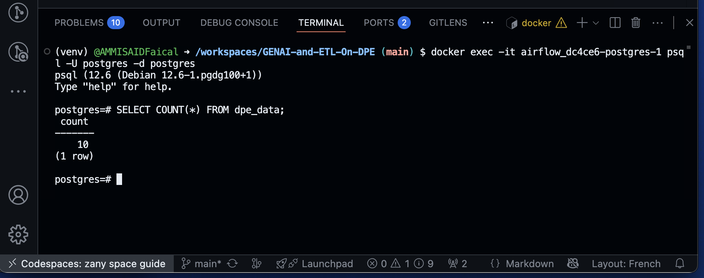

# GENAI-and-ETL-On-DPE
An **ETL pipeline built with Apache Airflow** that extracts, transforms, and loads **Diagnostics de Performance Energétique (DPE)** data from the [OpenDataSoft API](https://public.opendatasoft.com/explore/dataset/base-des-diagnostics-de-performance-energetique-dpe-des-batiments-non-residentie/) into a **PostgreSQL database**.

This project demonstrates how to orchestrate data workflows with Airflow, use Python for data cleaning, and persist data for analytics.
---

## Overview

The pipeline is designed to:

- Extract raw DPE records from the OpenDataSoft API  
- Transform and clean the data into a structured format using pandas  
- Load the cleaned data into a PostgreSQL database  
- Orchestrate the workflow with Airflow, including retries and scheduling  

### Airflow DAG


---

## Features

- **Extract**: Fetch raw JSON records from the OpenDataSoft API  
- **Transform**: Clean and structure data into a pandas DataFrame  
- **Load**: Store transformed data into **SQLite** (`dpe_data.db`) or PostgreSQL  
- **Orchestration**: Airflow DAG with retries, scheduling, and logging  
- **Containerized**: Ready to run in Docker with Astronomer/Airflow  

---

## ⚙️ Setup and running

### 1. Clone the repository
```bash
git clone https://github.com/AMMISAIDFaical/GENAI-and-ETL-On-DPE.git
cd GENAI-and-ETL-On-DPE/src/airflow
astro dev start
```

### Access Airflow UI
Open http://localhost:8080
Trigger the DAG dpe_etl_pipeline manually (test)

### Airflow DAG


### on the airflow ui
set up the postgres connection admin> connections


### back to the cli
double check if all records are in the postgres sql that last dag's task created



